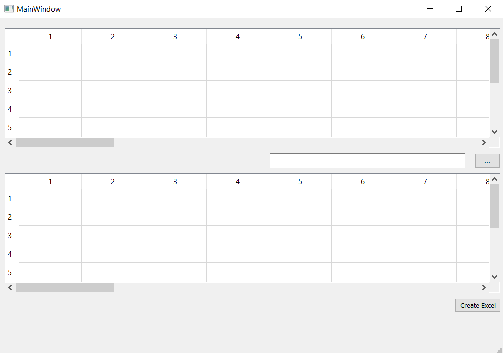

# excelToExcelInvoice

excelToExcelInvoice is a Python project that aims to facilitate the organization and declaration of invoice data obtained from the system. It automates the process of editing, categorizing, and reporting invoice data. Currently, it is under development.

## Features

- Reads and processes invoice data from Excel format.
- Edits and categorizes invoice data.
- Generates reports required for declaration purposes.
- Provides reliable results with automatic error detection and correction capabilities.

## Installation

1. Clone this repository to your local machine.
2. Navigate to the project directory:

```
cd excelToExcelInvoice
```


3. Install the required dependencies by running the following command:

```
pip install -r requirements.txt
```


## Usage

1. Add the Excel file containing the invoice data to the `data` folder.
2. Launch the program by running the following command in the project's root directory:
```
python main.py
```

3. The program reads the invoice data, performs data processing and generates reports.
4. The generated reports will be saved in the `output` folder.

## Contribution

If you would like to contribute to this project, please open an issue or submit a pull request, as it is currently under development.

## License

This project is licensed under the MIT License. See the `LICENSE` file for more information.



